# SFND 3D Object Tracking

Welcome to the final project of the camera course. By completing all the lessons, you now have a solid understanding of keypoint detectors, descriptors, and methods to match them between successive images. Also, you know how to detect objects in an image using the YOLO deep-learning framework. And finally, you know how to associate regions in a camera image with Lidar points in 3D space. Let's take a look at our program schematic to see what we already have accomplished and what's still missing.


In this final project, you will implement the missing parts in the schematic. To do this, you will complete four major tasks: 
1. First, you will develop a way to match 3D objects over time by using keypoint correspondences. 
2. Second, you will compute the TTC based on Lidar measurements. 
3. You will then proceed to do the same using the camera, which requires to first associate keypoint matches to regions of interest and then to compute the TTC based on those matches. 
4. And lastly, you will conduct various tests with the framework. Your goal is to identify the most suitable detector/descriptor combination for TTC estimation and also to search for problems that can lead to faulty measurements by the camera or Lidar sensor. In the last course of this Nanodegree, you will learn about the Kalman filter, which is a great way to combine the two independent TTC measurements into an improved version which is much more reliable than a single sensor alone can be. But before we think about such things, let us focus on your final project in the camera course. 

## Dependencies for Running Locally
* cmake >= 2.8
  * All OSes: [click here for installation instructions](https://cmake.org/install/)
* make >= 4.1 (Linux, Mac), 3.81 (Windows)
  * Linux: make is installed by default on most Linux distros
  * Mac: [install Xcode command line tools to get make](https://developer.apple.com/xcode/features/)
  * Windows: [Click here for installation instructions](http://gnuwin32.sourceforge.net/packages/make.htm)
* Git LFS
  * Weight files are handled using [LFS](https://git-lfs.github.com/)
* OpenCV >= 4.1
  * This must be compiled from source using the `-D OPENCV_ENABLE_NONFREE=ON` cmake flag for testing the SIFT and SURF detectors.
  * The OpenCV 4.1.0 source code can be found [here](https://github.com/opencv/opencv/tree/4.1.0)
* gcc/g++ >= 5.4
  * Linux: gcc / g++ is installed by default on most Linux distros
  * Mac: same deal as make - [install Xcode command line tools](https://developer.apple.com/xcode/features/)
  * Windows: recommend using [MinGW](http://www.mingw.org/)

## Basic Build Instructions

1. Clone this repo.
2. Make a build directory in the top level project directory: `mkdir build && cd build`
3. Compile: `cmake .. && make`
4. Run it: `./3D_object_tracking`.

## FP.1-Match 3D Objects

FP.1 is realized by the function `matchBoudingBoxes()` in the camFusion_Student.cpp file. First the key points in the overlapped areas between bounding boxes are removed and then the remaining key points correspondences are counted to find the best match bounding box in the next frame.  

## FP.2-Compute Lidar-based TTC

This part is realized by the function `computeTTCLidar()`in the camFusion_Student.cpp file.  Before the calculation, the point cloud outliers are removed by the RANSAC function `Ransac()`:

```
Ransac(indices_prev, lidarPointsPrev, maxIterations, distanceTol);
```

max Iterations argument is set to be 100 and the distance threshold is set to be 0.2m, which means point clouds exceeding 0.2m away from the back end plane of the preceding vehicle would be removed.  

The velocity is assumed to be constant when calculating Lidar-based TTC and the calculation formulas are shown below. 

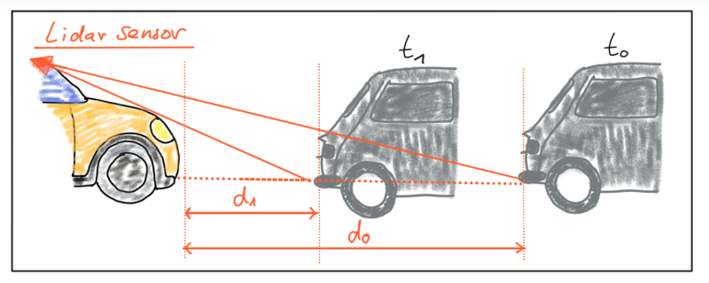

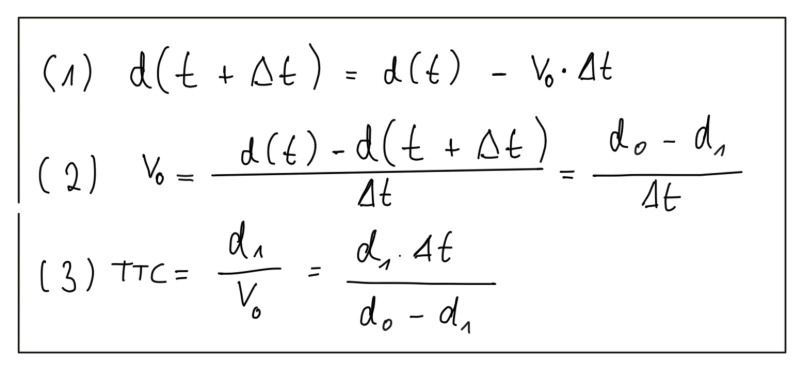

## FP.3-Associate Keypoint Correspondences with Bounding Boxes

This part corresponds to `clusterKptMatchesWithROI()`function in the camFusion_Student.cpp file.  All the key points matches are iterated and every key point  would be allocated to its corresponding bounding box if the  distance between its match is smaller than the threshold which is set to the average distance value. 

## FP.4-Compute Camera-based TTC

This part corresponds to `computeTTCCamera()`function in the camFusion_Student.cpp file. The theory is explained by set of formulas below:

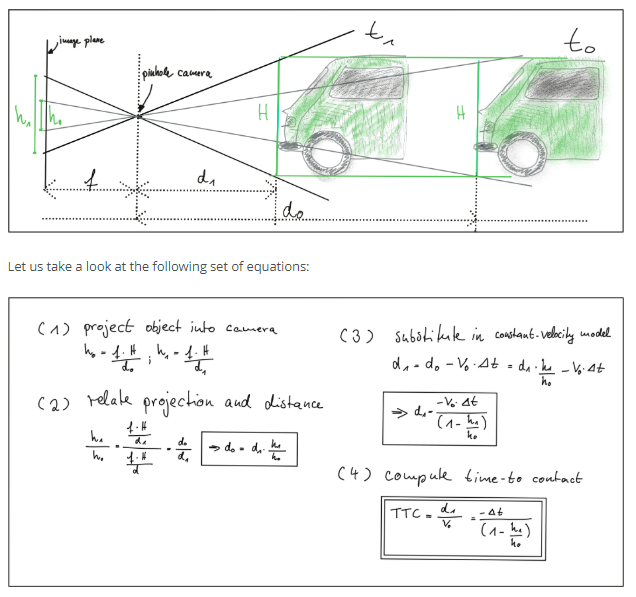

Instead of relying on the detection of the vehicle as a whole we now want to analyze its structure on a smaller scale, so the texture key points have been implemented for estimation. 

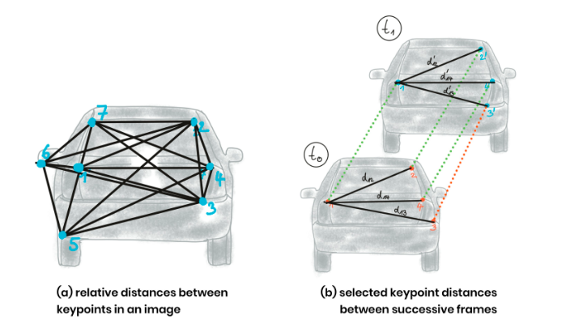

In (a), a set of keypoints has been detected and the relative distances between keypoints 1-7 have been computed. In (b), 4 keypoints have been matched between successive images (with keypoint 3 being a mismatch) using a higher-dimensional similarity measure called *descriptor* (more about that in the next lesson). The ratio of all relative distances between each other can be used to compute a reliable TTC estimate by replacing the height ratio h1 / h0   with the mean or median of all distance ratios d_k / d_k'.

The median distance ratio was used for computing to get more robust estimation TTCs against mismatches. 

## FP.5-Evaluation 1

To run the code, use the command below in the terminal under `build/` folder with detector and descriptor type as arguments. For example, if you want to implement ORB ORB combination:

```
./3D_object_tracking ORB ORB
```

From the top view perspective of the Lidar points, it can be found that the ego vehicle was coming closer to the preceding vehicle during the first 53 frames, then the relative position stays the same as the vehicle stopped. Therefore, the corresponding TTC should be relatively stable, small and positive during the first stage, while the absolute TTC value should be large in the second stage. 

The Lidar TTC of the first and second stages are shown respectively below:

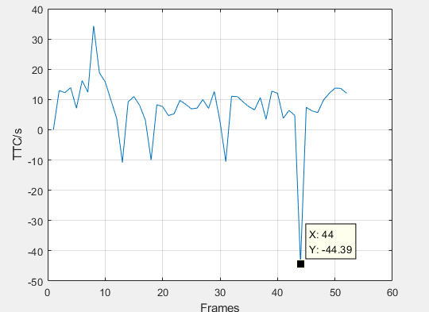

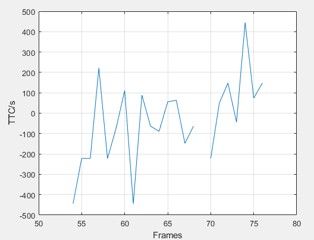

The absolute TTC values of the second stage are large because the distance of previous and current frames are quite close, which also makes the results sensitive to small changes of the point cloud distance. 

The TTCs in the 13th, 31st and 44th frame are negative, which is not reasonable according to the observation. The point clouds from the top view of the previous and current frame of the 31st frame is:

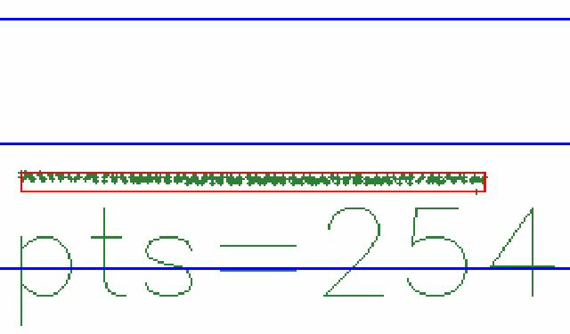 

  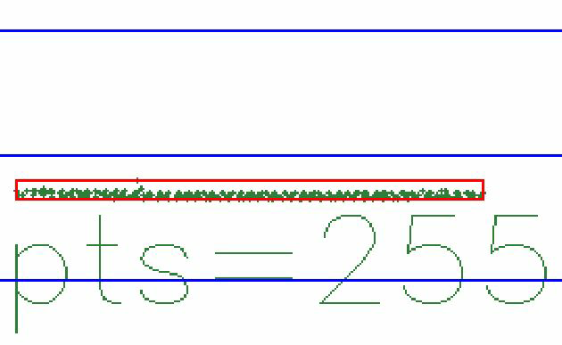

In this scenario, although RANSAC has been implemented with distance threshold of 0.2m to remove outliers, there is still a outlier making the distance of previous frame closer to ego vehicle  and caused a negative TTC estimation. The condition is the  same in the 44th frame, with the related figures shown below:

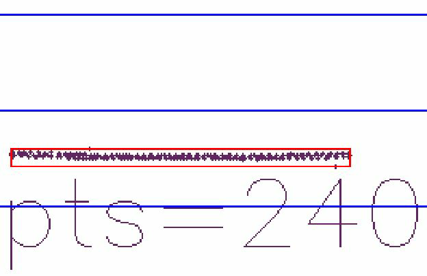

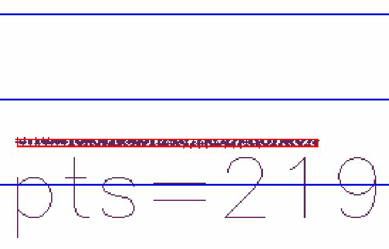

## FP.6-Evaluation 2

The TTC results of all combinations are illustrated in the spreadsheet below. The gray color means the combination not compatible, and the red color means inf number occurs during deceleration, which is unreasonable.  Since the vehicle stopped after the 54th frame,  only the average TTCs during 1st-53rd fram were calculated for comparison.  

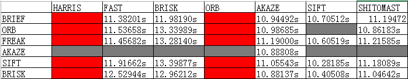

Two way-off scenarios were shown below, which occurred in ORB-ORB and HARRIS-FREAK combination during deceleration respectively. This was attribute to two aspects:

1.  There are too few key points matched in the bounding box to robustly estimate TTC against mismatches. 
2. There are some outliers enclosed in the bounding box, which are actually not belong to the preceding vehicle. 

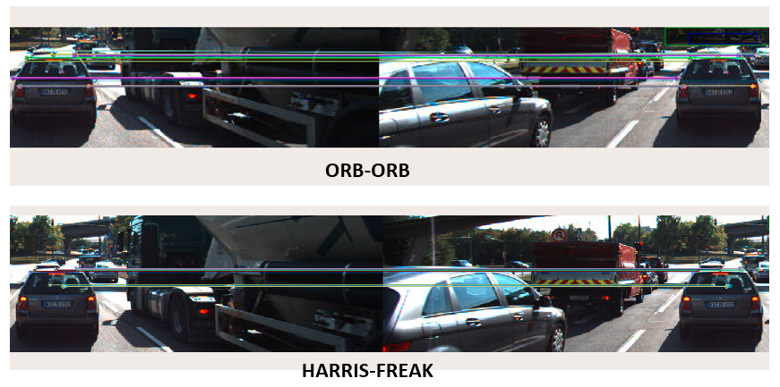

It can be deduced that the more key points matched in the preceding vehicle, the better the TTC results. 

The scenarios of the two recommended combinations which are FAST-FREAK and SIFT-BRISK are shown below. The matched key points are a lot more than that of two combinations mentioned above. Although there are still some outliers, the TTC can be estimated relatively accurate if the median distance ratio was picked for calculation. From the perspective of safety, the SIFT-BRISK combination is more suitable because the estimated TTC was smaller and more conservative. If the calculation time is the principal contradiction, the SIFT-BRISK is obviously better choice. 

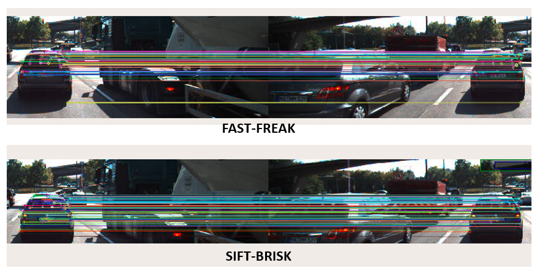

The variation of TTCs during deceleration process of the two recommended combinations:

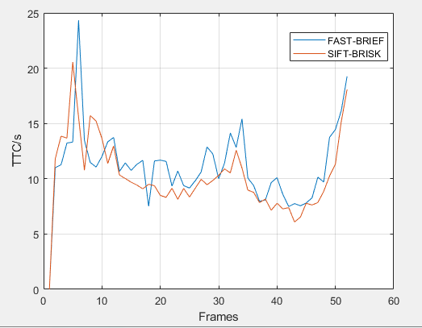

