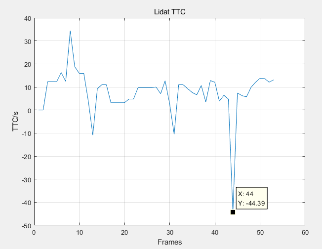
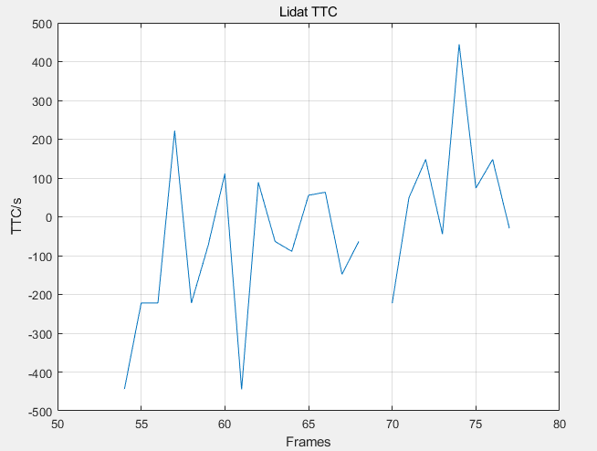
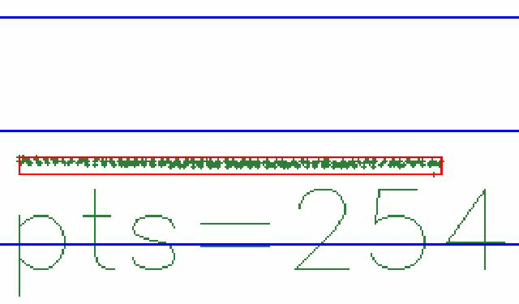
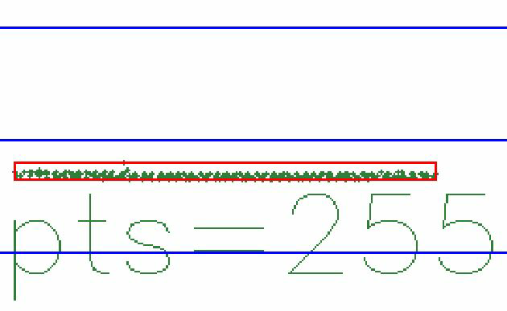
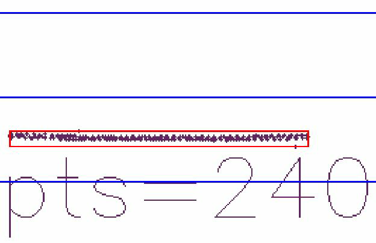
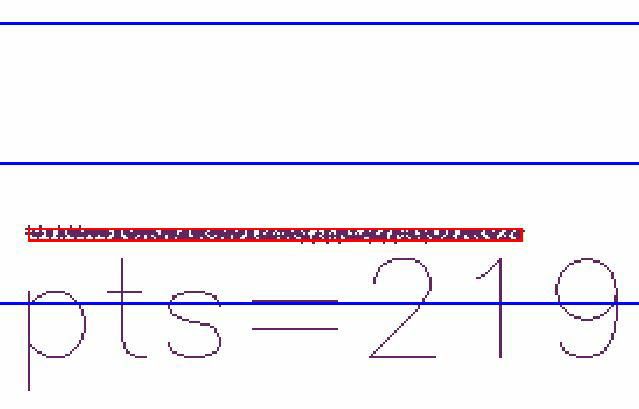

# SFND 3D Object Tracking

Welcome to the final project of the camera course. By completing all the lessons, you now have a solid understanding of keypoint detectors, descriptors, and methods to match them between successive images. Also, you know how to detect objects in an image using the YOLO deep-learning framework. And finally, you know how to associate regions in a camera image with Lidar points in 3D space. Let's take a look at our program schematic to see what we already have accomplished and what's still missing.

In this final project, you will implement the missing parts in the schematic. To do this, you will complete four major tasks: 
1. First, you will develop a way to match 3D objects over time by using keypoint correspondences. 
2. Second, you will compute the TTC based on Lidar measurements. 
3. You will then proceed to do the same using the camera, which requires to first associate keypoint matches to regions of interest and then to compute the TTC based on those matches. 
4. And lastly, you will conduct various tests with the framework. Your goal is to identify the most suitable detector/descriptor combination for TTC estimation and also to search for problems that can lead to faulty measurements by the camera or Lidar sensor. In the last course of this Nanodegree, you will learn about the Kalman filter, which is a great way to combine the two independent TTC measurements into an improved version which is much more reliable than a single sensor alone can be. But before we think about such things, let us focus on your final project in the camera course. 

## Dependencies for Running Locally
* cmake >= 2.8
  * All OSes: [click here for installation instructions](https://cmake.org/install/)
* make >= 4.1 (Linux, Mac), 3.81 (Windows)
  * Linux: make is installed by default on most Linux distros
  * Mac: [install Xcode command line tools to get make](https://developer.apple.com/xcode/features/)
  * Windows: [Click here for installation instructions](http://gnuwin32.sourceforge.net/packages/make.htm)
* Git LFS
  * Weight files are handled using [LFS](https://git-lfs.github.com/)
* OpenCV >= 4.1
  * This must be compiled from source using the `-D OPENCV_ENABLE_NONFREE=ON` cmake flag for testing the SIFT and SURF detectors.
  * The OpenCV 4.1.0 source code can be found [here](https://github.com/opencv/opencv/tree/4.1.0)
* gcc/g++ >= 5.4
  * Linux: gcc / g++ is installed by default on most Linux distros
  * Mac: same deal as make - [install Xcode command line tools](https://developer.apple.com/xcode/features/)
  * Windows: recommend using [MinGW](http://www.mingw.org/)

## Basic Build Instructions

1. Clone this repo.
2. Make a build directory in the top level project directory: `mkdir build && cd build`
3. Compile: `cmake .. && make`
4. Run it: `./3D_object_tracking`.

## FP.5-Evaluation 1

From the top view perspective of the Lidar points, it can be found that the ego vehicle was coming closer to the preceding vehicle during the first 53 frames, then the relative position stays the same as the vehicle stopped. Therefore, the corresponding TTC should be relatively stable, small and positive during the first stage, while the TTC should be large in the second stage. 

The Lidar TTC of the first and second stages are shown below:

The TTC of the second stage is large and because the distance of previous and current frames are quite close, which also makes the results sensitive to small changes of the point cloud distance. 

The TTC in the 13th, 31st and 44th frame is negative, which is not reasonable according to the observation. The point clouds from the top view of the previous and current frame of the 31st frame is:

 

  

In this scenario, although RANSAC has been implemented with distance threshold of 0.2m to remove outliers, there is still a outlier making the distance of previous frame closer to ego vehicle  and caused a negative TTC estimation. The condition is the  same in the 44th frame, with the related figures shown below:

## FP.6-Evaluation 2

All detector / descriptor combinations implemented in previous chapters have been compared with regard to the TTC estimate on a frame-by-frame basis. To facilitate comparison, a spreadsheet and graph should be used to represent the different TTCs.

